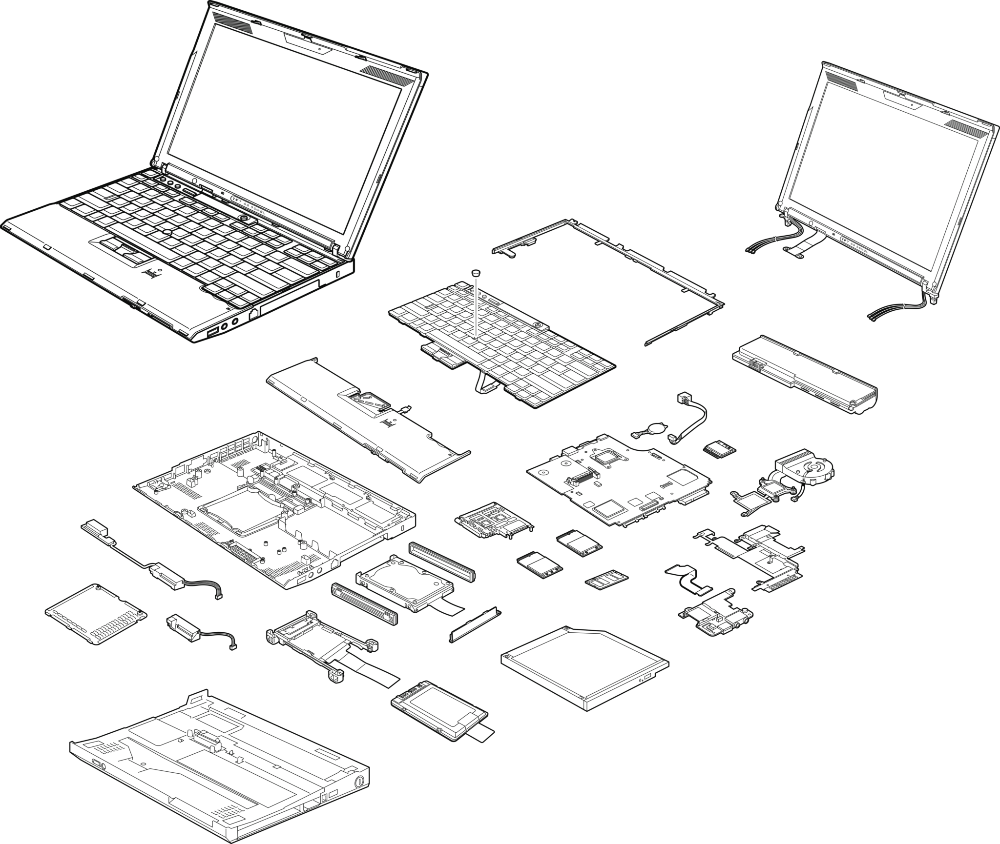

<h1 align='center'>X201</h1>
Last updatee: 24/7/2024

Fooling around with my X220 repo had me wanting more,
so i've decided to mobo transplat an Framework mainboard into a X201 chassie
with a few mods/upgrades.
My new go to distro for the time being is "Pop_OS" because it's polished.
feels well integrated and has emense support.

**Stuff 2do:**
* **Red ThinkLight mod**
* **Internal USB** - attach RTL8812AU. 
* **Speaker mod - Samsung note 10 or Ipad 11" pro speakers**
* **Mechanical keyboard feet** - for extra cooling
* 

