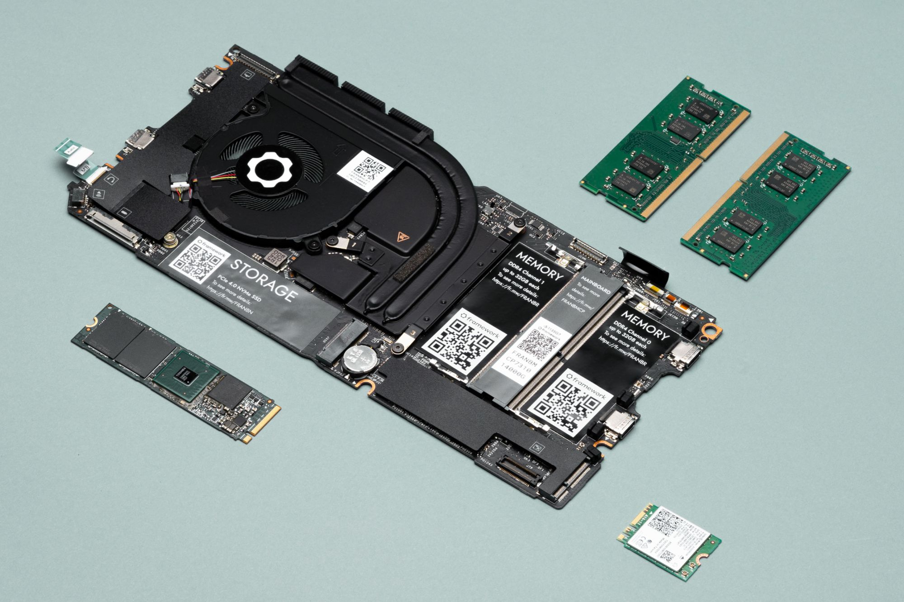
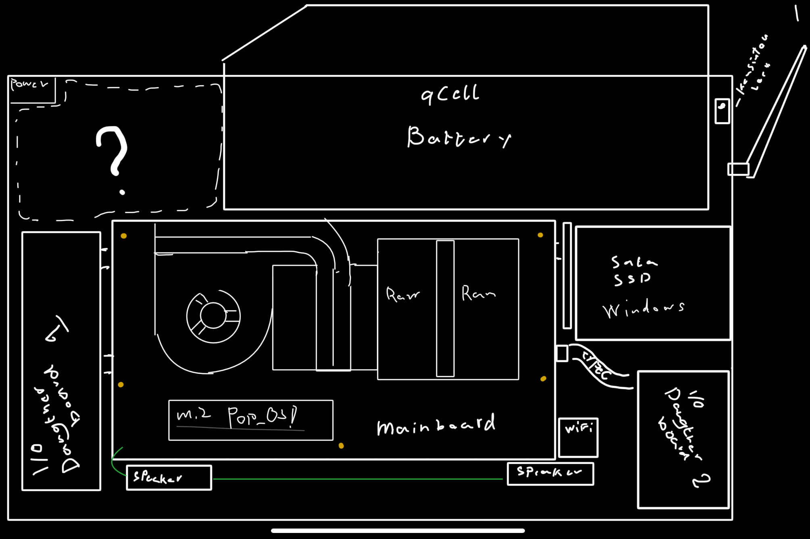

<h1 align='center'>X201</h1>

**Last update: 25 july 2024**

Fooling around with my X220 repo had me wanting more,
so i've decided to mobo transplat an Framework mainboard into a X201 chassie
with a few mods/upgrades.
My new go to distro for the time being is "Pop_OS" because it's polished.
feels well integrated and has emense support.

TLDR: Mission is to drop an framework mobo into an X201( basically a Framework/nb51 X2100 ) 

**Stuff 2do:**
* **Red ThinkLight mod**
* **Internal USB** - attach RTL8812AU. 
* **Speaker mod** - Samsung note 10 or Ipad 11" pro speakers
* **Mechanical keyboard fold out feet** - for extra cooling
* **Antenna mod** - Good ol mods
* **Custom I/O PCB daugther boards** - still looking into this
* **Framework mainboard bracket** - Get mobo from their outlet
* **convert CN2 keyboard bus connecter** - Keeping the lenovo keyboard ofc.
* **Adapt LVDS panel for mainboard** - (Convert eDP to LVDS if necessary)

Get the board from https://frame.work/dk/en/outlet

Resources:
* https://www.instructables.com/Make-a-ThinkPad-keyboard-USB-adapter-with-Arduino/
* https://www.xyte.ch/mods/x210-x2100/
* https://www.reddit.com/r/thinkpad/comments/s71mcx/i_3d_printed_a_new_trackpoint/ - i just want it

